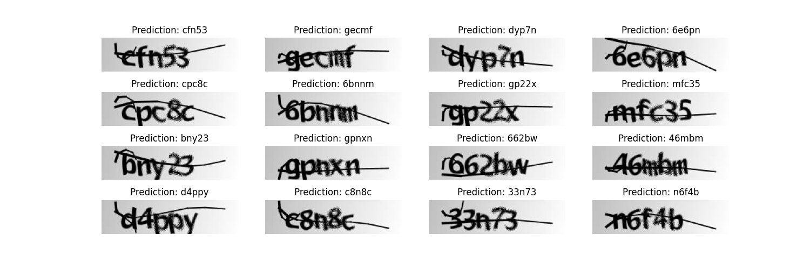

# A Practical Guide to Singularity - UT Data Engineering (Fall 2021)


This guide will introduce you to Singularity, a containerization system for scientific computing environments that is available on many scientific computing clusters. Containers allow you to package the environment that your code depends on inside of a portable unit. This is extremely useful for ensuring that your code can be run portably on other machines. It is also useful for installing software, packages, libraries, etc. in environments where you do not have root privileges, like an HPC account.
The repository contains the guide and files for the practical session of Singularity containers for the course Data Engineering at the University of Tartu.
It is divided in four parts and it goes from the installation process, knowing basic commands and finally a more advanced exercise.

## Part I. Installing Singularity

You have two options to get Singularity installed on your machine.

### Option 1: The Docker way (recommended for the practice session)

`docker` and `git` should be installed on your machine. Now we just need to create a container that has the dependencies and binary of singularity in it.

Download the contents of the repo:
```
$ git clone https://github.com/maheshbabuadapa/Singularity-Tutorial.git
$ cd Singularity-Tutorial
$ docker run --name singularity -v $(pwd)/material:/material -w /material -it --privileged snakemake/snakemake
```

Test that installation works.
```bash
$ singularity --version
singularity version 3.7.1
```

### Option 2: The traditional way

Depending on your machine, install the dependencies and the singularity program.
The [official website](https://sylabs.io/guides/3.5/user-guide/quick_start.html#quick-installation-steps) provides a comprehensive manual to get it done.

Test that installation works.
```bash
$ singularity --version
singularity version 3.7.1
```

Now clone the repository locally. If you have `git`, then just execute:

```
$ git clone https://github.com/maheshbabuadapa/Singularity-Tutorial.git
$ cd Singularity-Tutorial
```

Now you're ready to go :)

## Part II. First steps with Singularity

Singularity instantiates containers from images that define their environment. Singularity images are stored in `.sif` files.
You build a .sif file by defining your environment in a text file and providing that definition to the command singularity build.
Building an image file does require root privileges, so it is most convenient to build the image on your local machine or workstation and then copy it to your HPC cluster.
Once you've uploaded your image to your HPC cluster, you can submit a batch job that runs singularity exec with the image file you created and the command you want to run.

### Running containers

We can run containers from multiple different sources.

```
  *.sif               Singularity Image Format (SIF)
  *.sqsh              SquashFS format.  Native to Singularity 2.4+
  *.img               ext3 format. Native to Singularity versions < 2.4
  directory/          sandbox format. Directory containing a valid root file
  instance://*        A local running instance of a container
  library://*         A SIF container hosted on a Library
  docker://*          A Docker/OCI container hosted on Docker Hub
  shub://*            A container hosted on Singularity Hub
  oras://*            A SIF container hosted on an OCI registry

```

__Example 1__: Latest Ubuntu image from the Docker Hub.

```
$ singularity run docker://ubuntu:latest
$ docker run ubuntu:latest # Docker equivalent

$ cat /etc/issue
```

__Example 2__: Any image from the Docker Hub:

```
$ singularity run docker://godlovedc/lolcow
$ docker run godlovedc/lolcow # Docker equivalent
```

__Example 3__: Pre-built `.sif` file.

```
$ singularity run hello.sif
```

### Building our own image

To build a singularity container, you must use the `build` command.  The `build` command installs an OS, sets up your container's environment and installs the apps you need.  To use the `build` command, we need a **recipe file** (also called a definition file). A Singularity recipe file is a set of instructions telling Singularity what software to install in the container.

The Singularity source code contains several example definition files in the `/examples` subdirectory.  Let's copy the ubuntu example to our home directory and inspect it.

```
$ mkdir ../lolcow

$ cp examples/ubuntu/Singularity ../lolcow/

$ cd ../lolcow

$ nano Singularity
```

It should look something like this:

```
BootStrap: debootstrap
OSVersion: trusty
MirrorURL: http://us.archive.ubuntu.com/ubuntu/


%runscript
    echo "This is what happens when you run the container..."


%post
    echo "Hello from inside the container"
    sed -i 's/$/ universe/' /etc/apt/sources.list
    apt-get -y --force-yes install vim

```

See the [Singularity docs](http://singularity.lbl.gov/docs-recipes) for an explanation of each of these sections.

Now let's use this recipe file as a starting point to build our `lolcow.img` container. Note that the build command requires `sudo` privileges, when used in combination with a recipe file. 

```
$ sudo singularity build --sandbox lolcow Singularity
```

The `--sandbox` option in the command above tells Singularity that we want to build a special type of container for development purposes.  

Singularity can build containers in several different file formats. The default is to build a [squashfs](https://en.wikipedia.org/wiki/SquashFS) image. The squashfs format is compressed and immutable making it a good choice for reproducible, production-grade containers.  

But if you want to shell into a container and tinker with it (like we will do here), you should build a sandbox (which is really just a directory).  This is great when you are still developing your container and don't yet know what should be included in the recipe file.  

When your build finishes, you will have a basic Ubuntu container saved in a local directory called `lolcow`.

## Part III. Singularity for data analytics

For this part, I have included a PyTorch program, `train_xor.py`, that trains a neural network to compute the XOR function and then plots the loss as a function of training time. It can also save the model to a file. It depends on the Python modules `torch`, `numpy`, and `matplotlib`.


Let's use the `%post` section to install all of our requirements using
`apt-get` and `pip3`.

```
%post
    # These first few commands allow us to find the python3-pip package later
    # on.
    apt-get update -y
    # Using "noninteractive" mode runs apt-get while ensuring that there are
    # no user prompts that would cause the `singularity build` command to hang.
    DEBIAN_FRONTEND=noninteractive apt-get install -y --no-install-recommends \
        software-properties-common
    add-apt-repository universe
    # Downloads the latest package lists (important).
    apt-get update -y
    # python3-tk is required by matplotlib.
    DEBIAN_FRONTEND=noninteractive apt-get install -y --no-install-recommends \
        python3 \
        python3-tk \
        python3-pip \
        python3-distutils \
        python3-setuptools
    # Reduce the size of the image by deleting the package lists we downloaded,
    # which are useless now.
    rm -rf /var/lib/apt/lists/*
    # Install Python modules.
    pip3 install torch numpy matplotlib
```

Each line defines a separate command (lines can be continued with a `\`).
Unlike normal shell scripts, the build will be aborted as soon as one of the
commands fails. You do not need to connect the commands with `&&`.

The final build definition is in the file
[version-1.def](examples/xor/version-1.def).

Supposing we are on our own Ubuntu machine, we can build this definition into
a `.sif` image file using the following command:

```bash
cd examples/xor
sudo singularity build version-1.sif version-1.def
```

This ran the commands we defined in the `%post` section inside a container and
afterwards saved the state of the container in the image `version-1.sif`.


Let's run our PyTorch program in a container based on the image we just built.

```bash
singularity exec version-1.sif python3 train_xor.py --output model.pt
```

This program does not take long to run. Once it finishes, it should open a
window with a plot of the model's loss and accuracy over time.




The trained model should also be saved in the file `model.pt`. Note that even
though the program ran in a container, it was able to write a file to the host
file system that remained after the program exited and the container was shut
down. If you are familiar with Docker, you probably know that you cannot write
files to the host in this way unless you explicitly **bind mount** two
directories in the host and container file system. Bind mounting makes a file
or directory on the host system synonymous with one in the container.

For convenience, Singularity
[binds a few important directories by
default](https://www.sylabs.io/guides/3.2/user-guide/bind_paths_and_mounts.html):

* Your home directory
* The current working directory
* `/sys`
* `/proc`
* others (depending on the version of Singularity)

## Part IV. Conclusion

By now I think I have shown you that the sky is the limit when it comes to containers. Hopefully this will prove useful to your research.